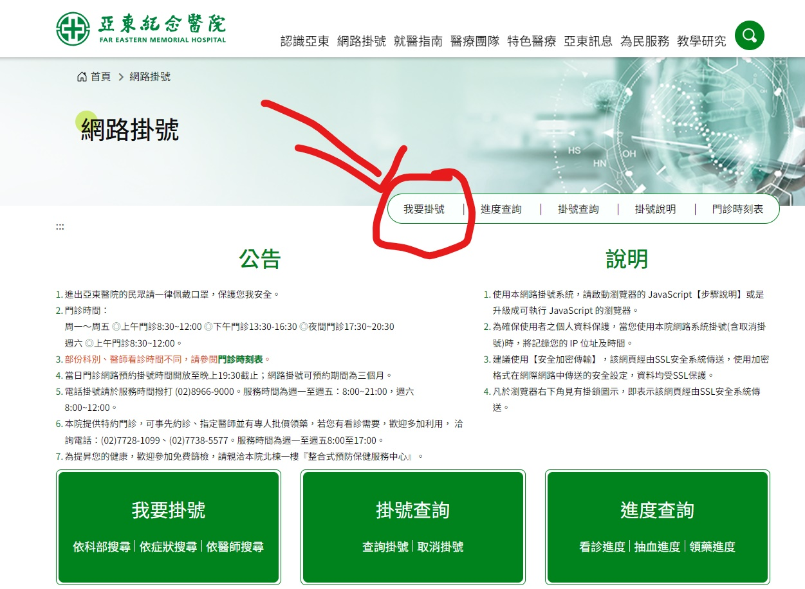
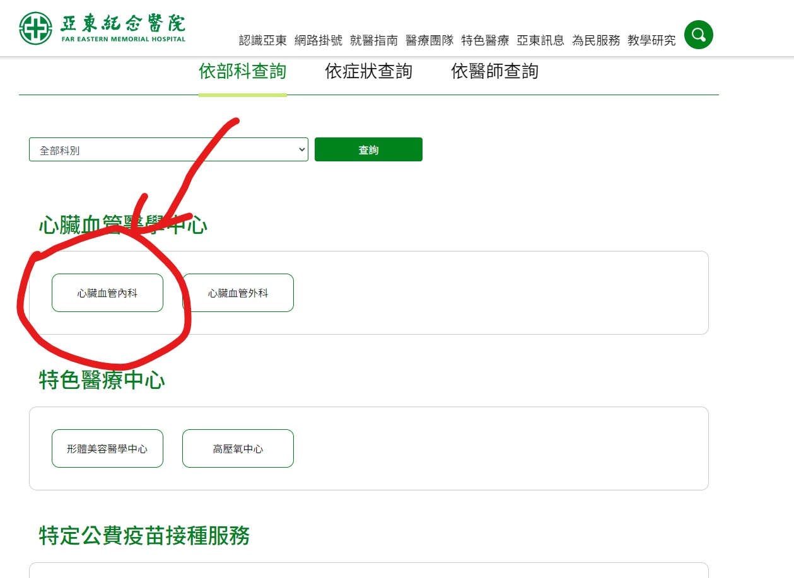
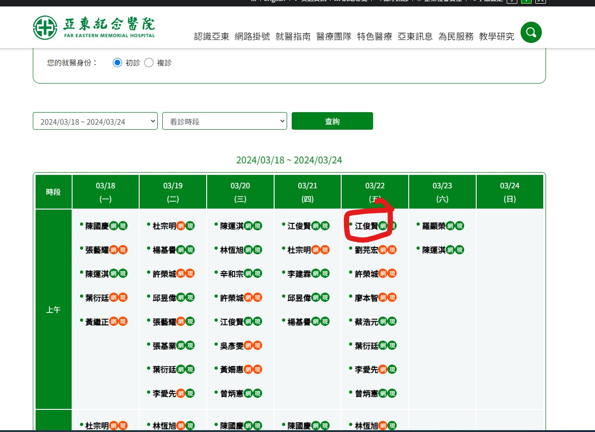
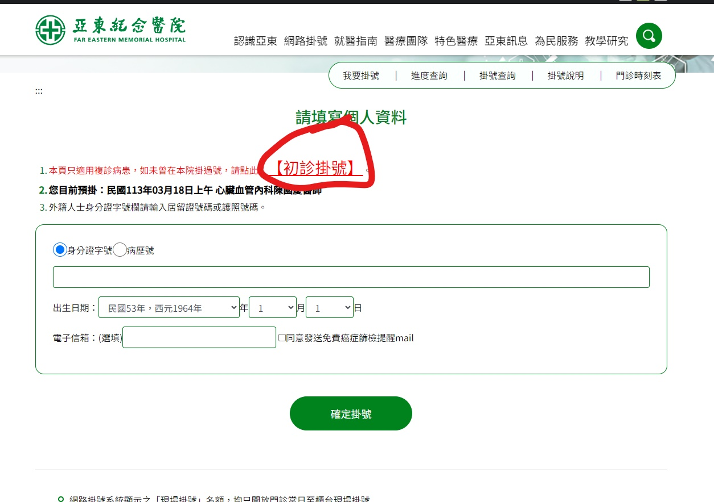
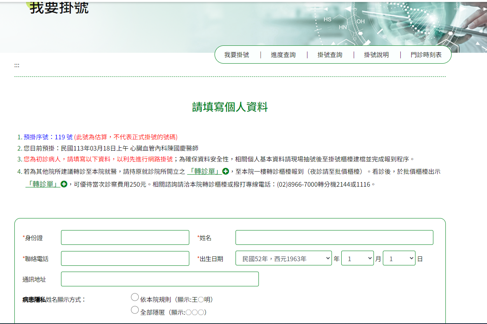
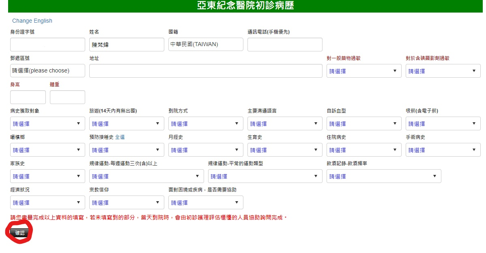
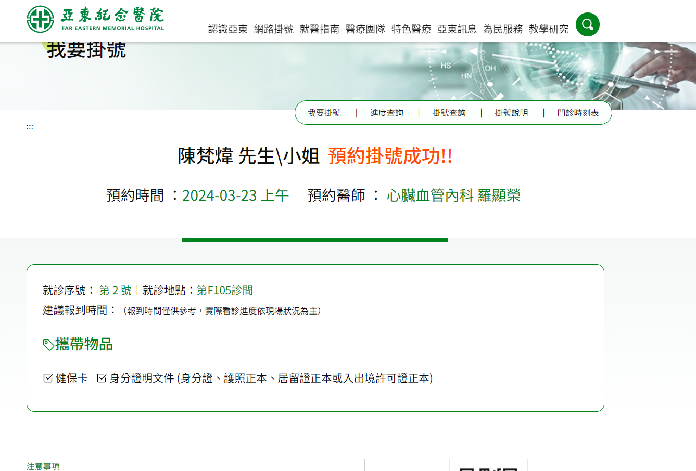

# 第2次作業-作業-HW2
>
>學號：111111108
> 
>姓名：陳梵煒
> 
>作業撰寫時間：180 (mins，包含程式撰寫時間)
> 
>最後撰寫文件日期：2024/03/18
>

本份文件包含以下主題：(至少需下面兩項，若是有多者可以自行新增)
- [x] 說明內容
- [x] 個人認為完成作業須具備觀念

## 說明程式與內容

進入亞東醫院系統，後按下我要掛號

隨機按下掛號

隨機點一名醫生

第一次掛號的話，要按初診掛號

開始填寫個人資料

按下初診病例

填入個人資料後按下確認

然後就掛號成功了!!

## 個人認為完成作業須具備觀念

開始寫說明，需要說明本次作業個人覺得需學會那些觀念，亦可作為學習筆記使用 (需寫成文章，需最少50字，並且文內不得有你、我、他三種文字)